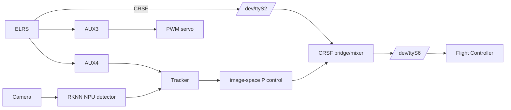

# Orange Pi FPV Tracking — RK3588 / RKNN / CRSF / PREEMPT_RT

Компьютерное зрение и сопровождение выбранной цели на **Orange Pi 5 Ultra (RK3588)** с прямым RKNNLite-инференсом на NPU, CRSF-мостом между ELRS-приёмником и полётным контроллером, подмешиванием коррекции yaw/pitch и отдельным PWM-управлением сервоприводом.


## Что реализовано

- V4L2 видеозахват (`/dev/video1` в рабочей конфигурации);
- прямой `RKNNLite` inference на NPU RK3588;
- YOLO-подобный decode + NumPy NMS без Ultralytics в рабочем inference-контуре;
- выбор цели мышью или AUX4;
- сопровождение по IoU + расстоянию центра с memory/reacquisition;
- коррекция yaw/pitch по ошибке положения цели в кадре;
- CRSF frame parser, passthrough и модификация RC channels;
- pilot override для ослабления автоматической коррекции;
- AUX4: OFF / CAPTURE / MIX;
- AUX3: три положения отдельной PWM-сервы;
- запись видео/CSV и скриншоты;
- fullscreen kiosk в X11;
- user-systemd автозапуск с автоматическим восстановлением после завершения процесса;
- документация по UART/Orange Pi overlays;
- восстановленная инструкция PREEMPT_RT с ручными исправлениями конфликтов патча;
- сохранённый kernel config рабочего `6.1.99-rt36`.

## Архитектура



Подробно: [`docs/architecture.md`](docs/architecture.md).

## Быстрый старт

```bash
git clone <YOUR_REPOSITORY_URL> orangepi-fpv-tracking
cd orangepi-fpv-tracking
chmod +x scripts/*.sh
./scripts/install.sh
```

Затем:

```bash
# включить uart2-m0 / uart6-m1 в /boot/orangepiEnv.txt
./scripts/configure_uart.sh

# положить production .rknn в models/yolov8n_416_rknn_model/
./scripts/verify_system.sh

# ручной запуск
./scripts/start_tracking_fullscreen.sh
```

Автозапуск:

```bash
systemctl --user enable --now tracking-stand.service
journalctl --user -u tracking-stand.service -f
```

## Важная безопасная настройка

Публичный конфиг поставляется с:

```yaml
mixing:
  enabled: false
```

Сначала проверьте изображение, выбранные каналы, направление коррекции, AUX и пределы сервы. Рабочий снимок конфигурации, где mixing был включён, сохранён отдельно как `config/tracking_crsf_direct_config.working-reference.yaml`.

## Структура

```text
.
├── tracking_crsf_lab.py
├── tracking_crsf_lab_direct.py
├── rknn_yolo_detector.py
├── servo_pwm_sysfs.py
├── config/
├── scripts/
├── systemd/
├── models/
├── docs/
├── rt/
└── extras/legacy-crsf-altitude-hold/
```

## Документация

- [Установка](docs/installation.md)
- [Архитектура](docs/architecture.md)
- [Аппаратная часть и UART/PWM](docs/hardware-and-io.md)
- [Конфигурация](docs/configuration.md)
- [Автозапуск и восстановление](docs/autostart.md)
- [Работа оператора](docs/operation.md)
- [Диагностика](docs/troubleshooting.md)
- [PREEMPT_RT — полная инструкция](docs/realtime-kernel.md)
- [PREEMPT_RT — краткая инструкция](docs/realtime-kernel-quick.md)
- [Baseline рабочей системы](docs/system-baseline.md)
- [RKNN benchmark notes](docs/benchmarks.md)
- [Deployment checklist](docs/deployment-checklist.md)
- [Что было изменено при упаковке](docs/source-notes.md)

## Рабочий baseline

В системе использовались Debian 12 Bookworm, `aarch64` и собственное ядро `6.1.99-rt36` с `PREEMPT_RT`. Полный kernel config сохранён в `rt/config-6.1.99-rt36`.

## Примечание о real-time

PREEMPT_RT ядро тестировалось через `cyclictest`. При этом текущий Python tracking-процесс сам по себе не переводится кодом в `SCHED_FIFO/SCHED_RR`; не следует описывать его как отдельную userspace hard-real-time задачу. RT-ядро уменьшает системную latency, а если понадобится отдельное планирование/CPU affinity для приложения, это следует добавлять и измерять отдельно.
