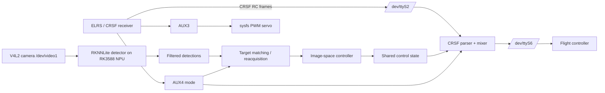

# Architecture

## Runtime data flow

## Main modules

- `tracking_crsf_lab.py` contains the CRSF framing/parser, shared state, serial bridge, channel conversion, control/overlay/recording loop and the optional Ultralytics path.
- `tracking_crsf_lab_direct.py` is the current runtime. It bypasses Ultralytics inference, uses `RKNNLite` directly, adds target memory/reacquisition, AUX4 mode logic and the AUX3 PWM servo.
- `rknn_yolo_detector.py` performs letterbox preprocessing, RKNN inference, decoding and NumPy NMS.
- `servo_pwm_sysfs.py` converts servo angles to PWM pulse widths and handles both normal and inverted PWM polarity.

## Visual control law

The current tracking code is **not a full PID** for yaw/pitch. It uses image-center error, dead zones, proportional gains (`kp_yaw`, `kp_pitch`), saturation and exponential smoothing (`alpha`). When the target is lost, the command decays toward zero.

The separate historical C++ module under `extras/legacy-crsf-altitude-hold/` contains earlier HOLD/LAND and altitude-control work. It is kept as source history and is not part of the visual-tracking runtime.

## Target tracking

The direct tracker stores the previous bounding box and class. Matching combines IoU and center distance. While the target is lost, the permitted search radius expands up to `reacquire_max_center_dist`; after reacquisition, the stored target state is refreshed.

## CRSF mixing

The bridge passes CRSF frames from receiver to FC. For RC channel frames it may replace pitch/yaw with pilot input plus bounded automatic correction. Mixing occurs only when all of the following are true:

1. `mixing.enabled` is true;
2. AUX4 is in MIX/high state;
3. the target is currently locked.

Pilot stick movement above `pilot_override_threshold` scales down the corresponding automatic correction.
